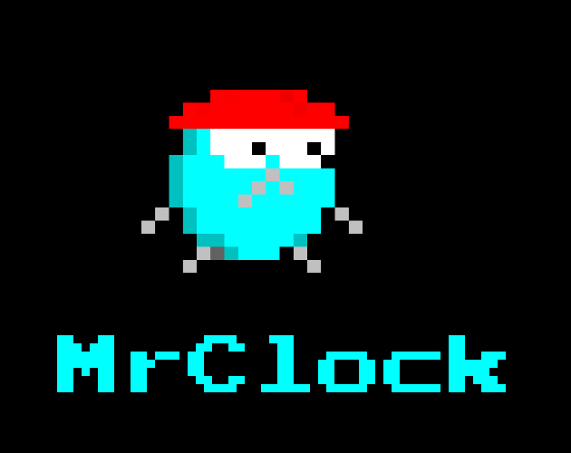
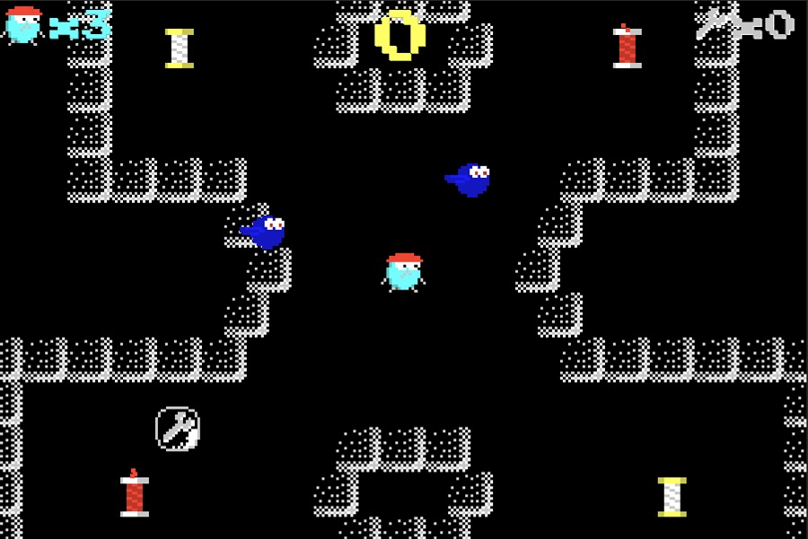

# MrClock

A simple pixel art arcade game made for [GameDev.tv Community Jam](https://itch.io/jam/gamedevtv-community-jam).    
The game can be played in the browser on [pixelook.itch.io/mrclock](https://pixelook.itch.io/mrclock).

## Videos

[Youtube: MrClock - Making of Boss level #1](https://www.youtube.com/watch?v=L2sH4zOLMpA)  
[Youtube: MrClock - Trailer](https://www.youtube.com/watch?v=sLkuvEPvZHI)

## Used tools
[Affinity Designer](https://affinity.serif.com/en-gb/designer/) - for drawing  
[Bfxr](http://bfxr.net/), [ocenaudio](https://www.ocenaudio.com) - for SFX and sounds  
[ecrettmusic](http://ecrettmusic.com/)​- for the music  
[Unity3d](https://unity.com) - hmm...

## Pictures

### Cover

### Concept

### From game

